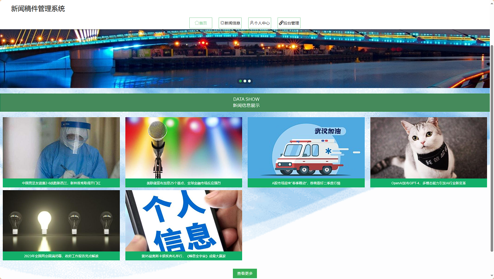
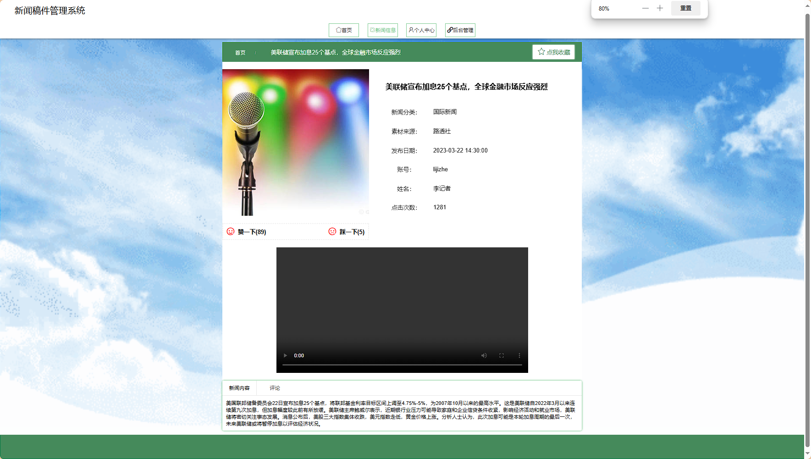
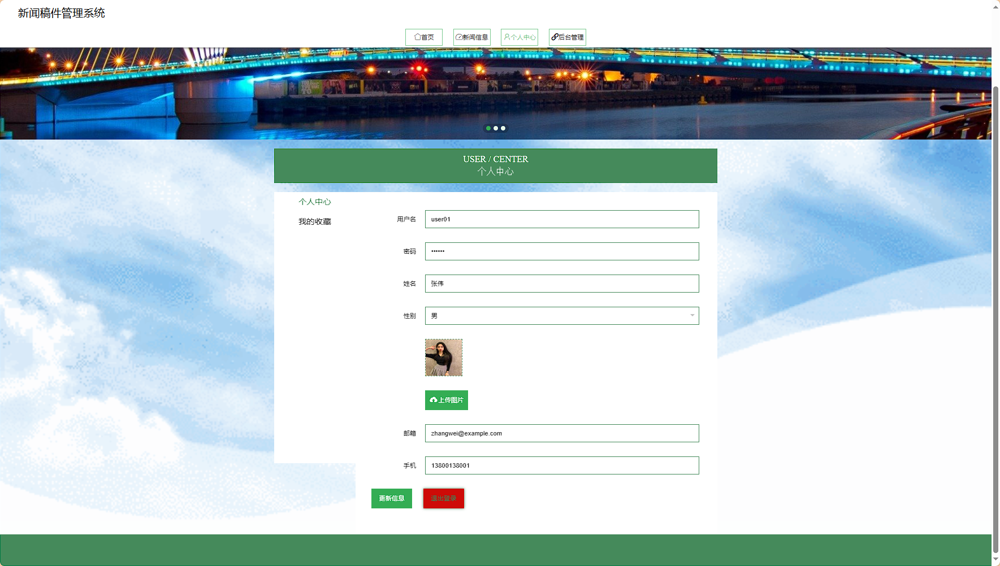
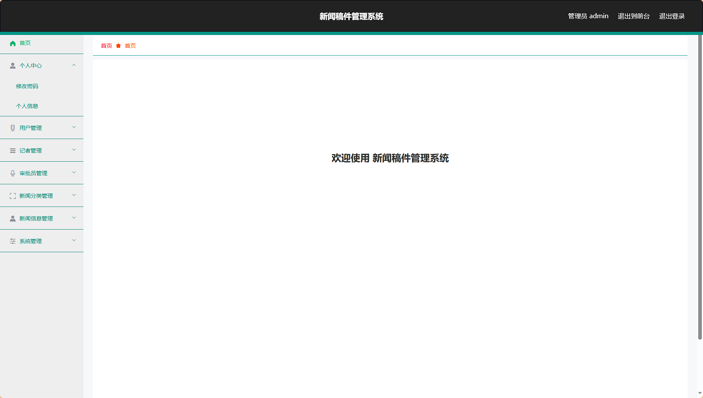
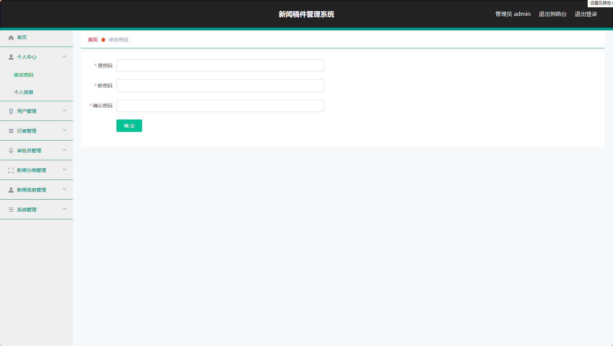
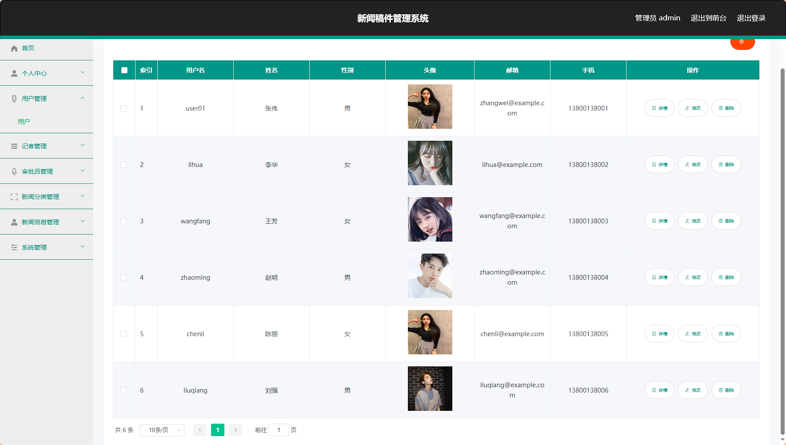
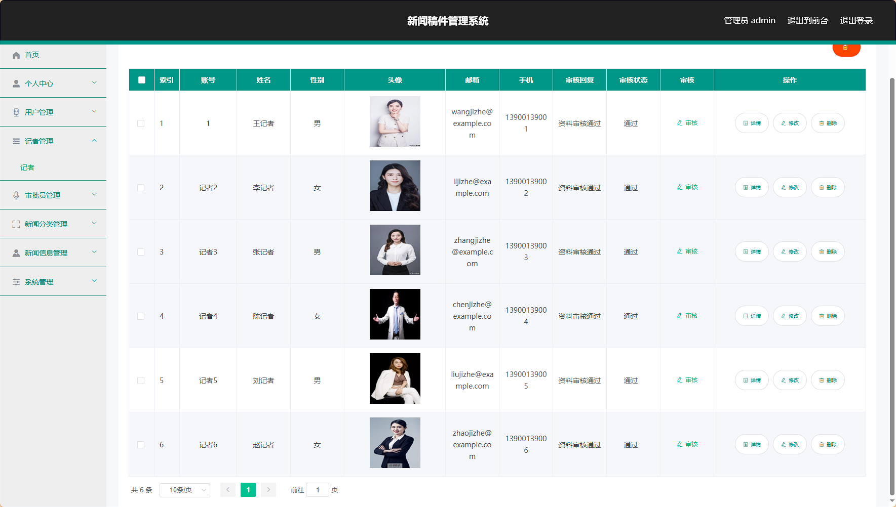
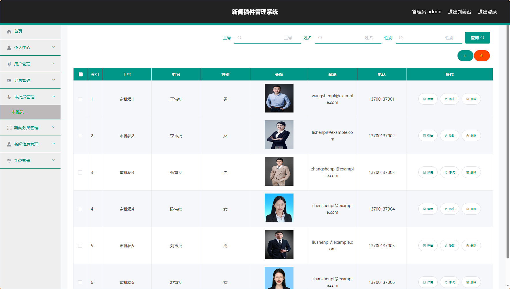
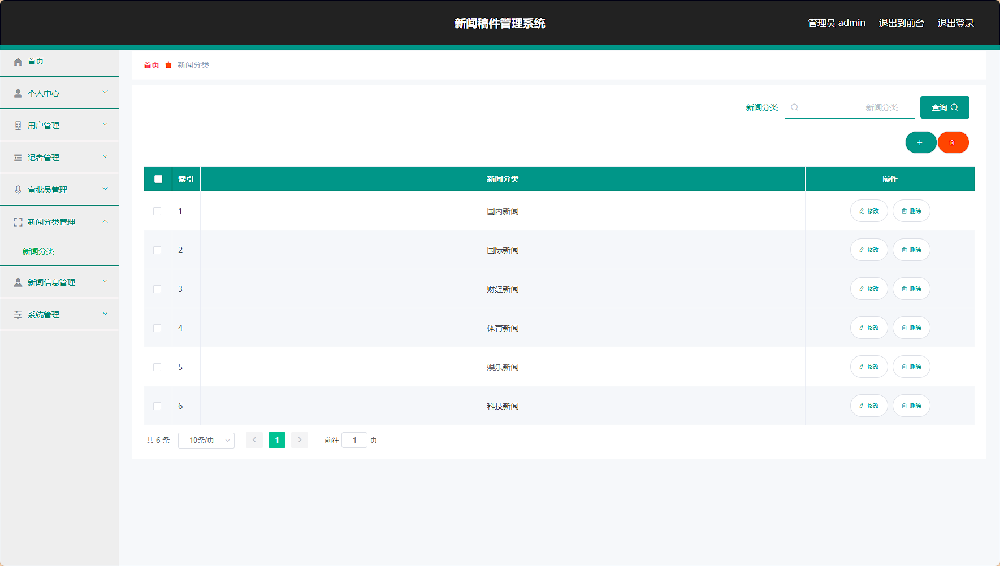
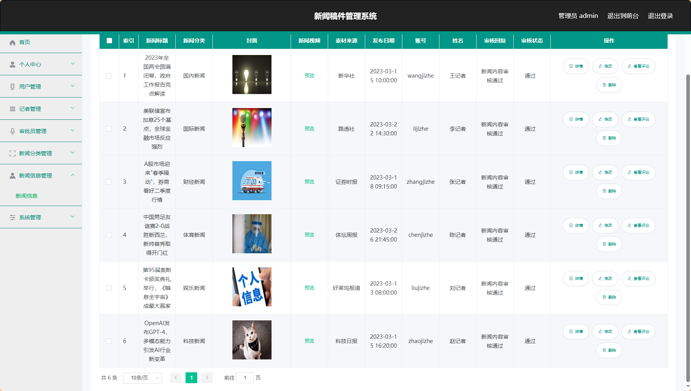

# 新闻稿件管理系统 / News_Manuscript_Management


> 更多毕设项目可跳转至项目导航栏检索：[毕设项目](http://sysadmin.3vfree.vip)，需要联系博主v：xq-lucky311，q：1047944234. 备注：项目咨询

注：由于前端项目太大，仅上传了后端代码，未包含前端代码...

## 项目简介  
基于 SpringBoot + MyBatis-Plus + Shiro 的新闻稿件管理系统，采用 B/S 架构实现记者发布、审批员审核、用户查看的全流程管理，支持角色权限控制和多模块协同工作。

## 特征介绍  
- **权限控制**：集成 Shiro 实现管理员/记者/审批员/用户四级权限体系，支持动态鉴权。  
- **高效开发**：MyBatis-Plus 简化数据库操作，零 SQL 实现单表 CRUD 功能。  
- **多工具集成**：内置文件上传、MD5加密、百度AI等工具类，提升系统扩展性。  
- **模块化设计**：严格分层 controller/service/entity/dao 结构，支持功能快速迭代。  
- **审核流程**：实现新闻稿件"发布-审核-展示"完整工作流，符合媒体行业规范。  

## 代码结构 
```
src/
├── main/
│   ├── java/
│   │   ├── com/
│   │   │   ├── SpringbootSchemaApplication.java      # 启动类
│   │   │   ├── annotation/                           # 权限注解
│   │   │   │   ├── IgnoreAuth.java
│   │   │   │   ├── LoginUser.java
│   │   │   ├── config/                               # 全局配置
│   │   │   │   ├── InterceptorConfig.java
│   │   │   │   ├── MybatisPlusConfig.java
│   │   │   ├── controller/                           # 接口层
│   │   │   │   ├── JizheController.java
│   │   │   │   ├── ShenpiyuanController.java
│   │   │   ├── dao/                                  # 数据访问层
│   │   │   │   ├── JizheDao.java
│   │   │   │   ├── ShenpiyuanDao.java
│   │   │   ├── entity/                               # 数据模型
│   │   │   │   ├── JizheEntity.java
│   │   │   │   ├── ShenpiyuanEntity.java
│   │   │   │   ├── model/                            # 业务模型
│   │   │   │   │   ├── XinwenxinxiModel.java
│   │   │   ├── service/                              # 服务层
│   │   │   │   ├── JizheService.java
│   │   │   │   ├── ShenpiyuanService.java
│   │   │   │   ├── impl/                             # 服务实现
│   │   │   │   │   ├── JizheServiceImpl.java
│   │   │   ├── utils/                                # 工具类
│   │   │   │   ├── FileUtil.java
│   │   │   │   ├── MD5Util.java
│   ├── resources/
│   │   ├── application.yml                           # 主配置
│   │   ├── mapper/                                   # MyBatis映射
│   │   │   ├── JizheDao.xml
│   │   │   ├── ShenpiyuanDao.xml
│   │   ├── static/                                   # 静态资源
│   │   │   ├── upload/                               # 上传目录
```
## 使用说明
1. **推荐浏览器**：谷歌浏览器
2. **后台地址**：http://localhost:8080/springboot9n107/admin/dist/index.html  
   - 管理员账号：abo / abo
3. **前台地址**：http://localhost:8080/springboot9n107/front/index.html  
4. **数据库配置**：  
   修改 `src/main/resources/application.yml`：  
   ```yaml
   url: jdbc:mysql://127.0.0.1:3306/springboot9n107?useUnicode=true
   username: root
   password: 123456  # 改为实际数据库密码


# 项目实际截图：
## 登录：


## 前台：




## 后台：








> 等等...

# 精选项目导航 & 快速部署工具
## 项目资源一站直达
- ​**访问项目导航站**：[点击进入](http://sysadmin.3vfree.vip)**快速检索所需项目名称**
- ​**技术栈全覆盖**：Java/SSm/Spring Boot/小程序等主流技术方案
- ​**配套资源**：每个项目均提供部署文档 + 演示视频（附效果截图）

### ▌导航站预览


### ▌工具界面预览


## 捐赠
> 博主将持续更新Java全栈开发项目，包含ssm，springboot，前后端分离系统等项目。
> 此外如果您够宽裕，请博主喝杯咖啡吧！捐赠将用于服务器维护与开源社区建设，感谢您的认可！
> 如需更多Java相关项目毕设3000+，有其他项目需求，sql文件等可联系博主v:xq-lucky311

---
